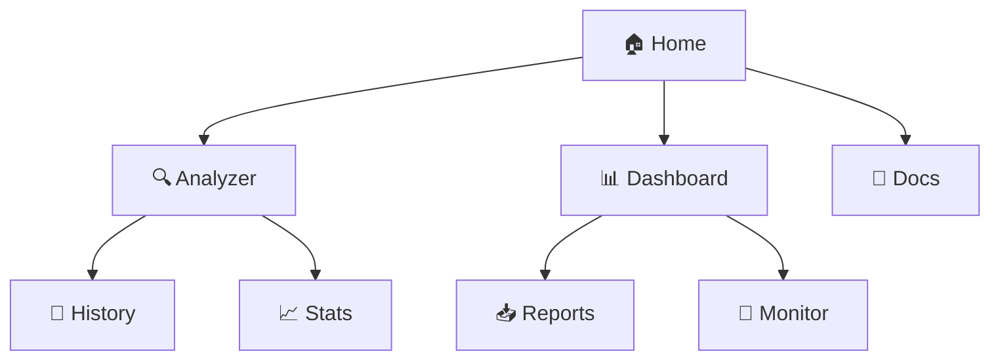

<div align="center">


# 🌐 Phishing Detection Web Frontend

### ✨ Modern Interface | 📊 Complete Dashboard | 🎭 Fluid Animations | 📱 100% Responsive

[](https://nextjs.org/)
[](https://reactjs.org/)
[](https://www.typescriptlang.org/)
[](https://tailwindcss.com/)
[](https://www.framer.com/motion/)

<br>

### 🚀 [View Live Demo](#) • [🔌 API Backend](https://github.com/Dxnn017/CyberSentinel) • [📖 API Documentation](https://cybersentinel-csdr.onrender.com/docs)

<br>

```ascii
╔══════════════════════════════════════════════════════════════════╗
║                                                                  ║
║   🖥️  Aplicación web completa para análisis de URLs             ║
║   🎨 Interfaz moderna con tema oscuro y animaciones             ║
║   📊 Dashboard con estadísticas en tiempo real                  ║
║   📱 Diseño responsive: móvil, tablet y desktop                 ║
║   🎯 Integración directa con API de CyberSentinel               ║
║                                                                  ║
╚══════════════════════════════════════════════════════════════════╝
```

</div>

---

## 💡 What is CyberSentinel Web?

> **The visible face of the phishing detection system**

**CyberSentinel Web** is the **frontend application** that transforms the power of the AI engine into an intuitive and visual user experience. Built with **Next.js 15** and **React 19**, it offers a modern interface for any user to analyze URLs and protect themselves against phishing.

<table>
<tr>
<td width="50%">

### 🎯 **For Whom?**

- 👥 **End Users**
  - Analyze suspicious URLs
  - View analysis history
  - Learn about security

- 👨‍💼 **Businesses**
  - Statistics dashboard
  - Export reports (CSV/JSON)
  - Real-time monitor

- 🎓 **Educational**
  - Security tips
  - API documentation
  - Code examples

</td>
<td width="50%">

### ⚡ **What's Included?**



✅ **URL Analyzer** with instant results  
✅ **Complete dashboard** with visual metrics  
✅ **Persistent history** in localStorage  
✅ **Data export** (CSV/JSON)  
✅ **Live monitor** of latest analyses  
✅ **Educational** security tips  

</td>
</tr>
</table>

### ✨ Características de la Interfaz

<div align="center">

| 🎨 UI/UX | 📊 Funcionalidad | ⚡ Performance |
|----------|------------------|---------------|
| 🌙 **Modo Oscuro Premium** | 🔍 **Analizador Inteligente** | ⚡ **<100ms Render** |
| Tema slate optimizado | Validación en tiempo real | Server Components |
| 🎭 **Animaciones Fluidas** | 📊 **Dashboard Interactivo** | 🚀 **ISR Optimizado** |
| Framer Motion | Stats en vivo (5s refresh) | Incremental Static |
| 📱 **100% Responsive** | 📜 **Historial Completo** | 🎯 **Tree Shaking** |
| Mobile-first design | Persistencia localStorage | Code splitting auto |
| 🎨 **40+ Componentes** | 📥 **Export Reportes** | 💾 **Caché Inteligente** |
| shadcn/ui + Radix | CSV y JSON | Service Worker |

</div>

<details>
<summary>🎯 <strong>Ver Páginas y Secciones</strong></summary>

<br>

**🏠 Página Principal (`/`)**
```
├── 🎯 Hero Section con animación
├── 🔍 Analizador de URLs
├── 📊 Dashboard de estadísticas
├── 📜 Historial de análisis
└── 💡 Consejos de seguridad
```

**📊 Dashboard (`/dashboard`)**
```
├── 📈 Métricas avanzadas (F1, ROC-AUC)
├── ⚙️  Información del modelo
├── 🚨 Alertas de seguridad
├── 📜 Historial completo
└── 📥 Generador de reportes
```

**📖 Documentación (`/documentation`)**
```
├── 🔌 API Documentation
├── 📝 Ejemplos de código
├── 🛡️ Mejores prácticas
├── 🤖 Info del modelo IA
└── 🧩 Extensión de navegador
```

</details>

<details>
<summary>🔥 <strong>Ver Stack Tecnológico Completo</strong></summary>

<br>

```typescript
// Framework & Core
Next.js 15          → App Router + RSC
React 19            → Biblioteca UI
TypeScript 5        → Type Safety

// Estilos & Animaciones
Tailwind CSS 4      → Utility-first CSS
Framer Motion       → Animaciones fluidas
shadcn/ui           → Componentes base
Radix UI            → Primitivas accesibles

// UI Components
Lucide Icons        → Iconos modernos
Recharts            → Gráficos (si aplica)
Sonner              → Toast notifications

// Estado & Datos
React Hooks         → Estado local
localStorage        → Persistencia
Fetch API           → HTTP requests

// Developer Tools
ESLint              → Linting
Prettier            → Formatting
pnpm                → Package manager
```

</details>

---

## 🖼️ Capturas de Pantalla

<div align="center">

### 🏠 Página Principal


### 📊 Dashboard


### 📖 Documentación


</div>

---

## 🚀 Demo en Vivo

### 🌐 Aplicación Desplegada

```
URL: https://cybersentinel-web.vercel.app (próximamente)
```

### 🔌 API Backend

La aplicación se conecta a la API de CyberSentinel:
```
API: https://cybersentinel-csdr.onrender.com
Docs: https://cybersentinel-csdr.onrender.com/docs
```

---

## 🛠️ Instalación Local

### 📋 Requisitos Previos

- Node.js 18.0 o superior
- pnpm (recomendado) o npm
- Git

### 🔧 Instalación

```bash
# 1️⃣ Clonar el repositorio
git clone https://github.com/Dxnn017/cybersentinel-web.git
cd cybersentinel-web

# 2️⃣ Instalar dependencias
pnpm install
# o con npm
npm install

# 3️⃣ Configurar variables de entorno (opcional)
cp .env.example .env.local

# 4️⃣ Ejecutar en modo desarrollo
pnpm dev
# o con npm
npm run dev
```

La aplicación estará disponible en: **http://localhost:3000**

### 🏗️ Build de Producción

```bash
# Generar build optimizado
pnpm build

# Ejecutar en modo producción
pnpm start
```

---

## 📁 Estructura del Proyecto

```
cybersentinel-web/
├── 📂 app/                              # App Router de Next.js 15
│   ├── 📄 layout.tsx                   # Layout principal
│   ├── 📄 page.tsx                     # Página de inicio
│   ├── 📄 globals.css                  # Estilos globales
│   │
│   ├── 📂 api/                         # API Routes (deprecadas - ahora usa API externa)
│   │   ├── analyze/
│   │   ├── history/
│   │   └── stats/
│   │
│   ├── 📂 dashboard/                   # Panel de control
│   │   └── 📄 page.tsx
│   │
│   └── 📂 documentation/               # Documentación
│       └── 📄 page.tsx
│
├── 📂 components/                       # Componentes React
│   ├── 📄 url-analyzer.tsx            # Analizador principal
│   ├── 📄 url-analyzer-card.tsx       # Card con animaciones
│   ├── 📄 analysis-history.tsx        # Historial de análisis
│   ├── 📄 analysis-stats.tsx          # Estadísticas
│   ├── 📄 stats-dashboard.tsx         # Dashboard completo
│   ├── 📄 real-time-monitor.tsx       # Monitor en vivo
│   ├── 📄 report-generator.tsx        # Generador de reportes
│   ├── 📄 security-tips.tsx           # Consejos de seguridad
│   ├── 📄 threat-level-indicator.tsx  # Indicador de amenazas
│   ├── 📄 detection-performance.tsx   # Métricas de rendimiento
│   ├── 📄 hero-section.tsx            # Hero de página principal
│   ├── 📄 navigation.tsx              # Barra de navegación
│   │
│   └── 📂 ui/                          # Componentes de UI base
│       ├── 📄 button.tsx
│       ├── 📄 card.tsx
│       ├── 📄 input.tsx
│       ├── 📄 badge.tsx
│       ├── 📄 alert.tsx
│       └── ... (40+ componentes)
│
├── 📂 lib/                              # Utilidades
│   └── 📄 utils.ts                     # Funciones auxiliares
│
├── 📂 hooks/                            # Custom Hooks
│   ├── 📄 use-toast.ts                 # Hook de notificaciones
│   └── 📄 use-mobile.ts                # Hook responsive
│
├── 📂 styles/                           # Estilos adicionales
│   └── 📄 globals.css
│
├── 📂 public/                           # Archivos estáticos
│
├── ⚙️  next.config.mjs                  # Configuración Next.js
├── ⚙️  tsconfig.json                    # Configuración TypeScript
├── ⚙️  tailwind.config.ts               # Configuración Tailwind
├── ⚙️  postcss.config.mjs               # Configuración PostCSS
├── ⚙️  components.json                  # Configuración shadcn/ui
├── 📦 package.json                      # Dependencias
├── 📦 pnpm-lock.yaml                    # Lock de pnpm
└── 📖 README.md                         # Este archivo
```

---

## 🎨 Tecnologías

### 🔧 Framework & Lenguaje

```
Next.js 15       - Framework React con App Router
React 19         - Biblioteca UI
TypeScript 5     - Tipado estático
```

### 💅 Estilos & UI

```
Tailwind CSS 4    - Framework CSS utility-first
Framer Motion     - Animaciones fluidas
shadcn/ui         - Componentes de UI modernos
Radix UI          - Componentes accesibles
Lucide Icons      - Iconos modernos
```

### 📊 Gestión de Estado & Datos

```
React Hooks       - Estado local
localStorage      - Persistencia de datos
Fetch API         - Comunicación con backend
```

### 🛠️ Herramientas de Desarrollo

```
ESLint            - Linting de código
Prettier          - Formateo de código
pnpm              - Gestor de paquetes
```

---

## 🌟 Características Detalladas

### 🔍 Analizador de URLs

- **Input inteligente** con validación en tiempo real
- **Análisis instantáneo** con la API de CyberSentinel
- **Feedback visual** con animaciones y colores
- **Detalles completos** de características extraídas
- **Historial automático** de todas las URLs analizadas

### 📊 Dashboard de Estadísticas

- **Total de URLs analizadas**
- **Sitios legítimos vs phishing**
- **Confianza promedio del modelo**
- **Tasa de detección de phishing**
- **Gráficos interactivos**
- **Actualización en tiempo real**

### 📜 Historial de Análisis

- **Lista completa** de URLs analizadas
- **Filtros** por tipo (phishing/legítimo)
- **Ordenamiento** por fecha
- **Búsqueda** de URLs específicas
- **Paginación** para grandes datasets
- **Persistencia** en localStorage

### 📥 Generador de Reportes

- **Exportación CSV** para Excel/Sheets
- **Exportación JSON** para APIs
- **Incluye todas las métricas**
- **Timestamp de generación**
- **Formato profesional**

### 🔴 Monitor en Tiempo Real

- **Últimas 5 URLs** analizadas
- **Actualización cada 5 segundos**
- **Código de colores** por riesgo
- **Timestamp** de cada análisis

### 💡 Consejos de Seguridad

- **Tips educativos** sobre phishing
- **Mejores prácticas** de seguridad
- **Iconos visuales** atractivos
- **Animaciones suaves**

### 📖 Documentación API

- **Ejemplos de código** completos
- **Endpoints** disponibles
- **Formato de requests/responses**
- **Botón de copiar** código
- **Sintaxis resaltada**

---

## 🔌 Integración con API

### 🌐 Configuración

La aplicación se conecta automáticamente a la API de CyberSentinel:

```typescript
const API_URL = "https://cybersentinel-csdr.onrender.com";

// Analizar una URL
const response = await fetch(`${API_URL}/analyze`, {
  method: "POST",
  headers: { "Content-Type": "application/json" },
  body: JSON.stringify({ url: urlToAnalyze })
});

const result = await response.json();
```

### 📊 Estructura de Respuesta

```typescript
interface AnalysisResult {
  url: string;
  is_phishing: boolean;
  confidence: number;
  risk_level: string;
  risk_score: number;
  features: {
    url_length: number;
    domain_length: number;
    // ... más características
  };
  timestamp: string;
}
```

### 💾 Persistencia Local

Los análisis se guardan en `localStorage` para mantener el historial:

```typescript
localStorage.setItem('analysisHistory', JSON.stringify(history));
```

---

## 🎨 Temas y Personalización

### 🌙 Modo Oscuro

La aplicación usa un tema oscuro optimizado por defecto:

```css
/* Colores principales */
--background: #0f172a (slate-950)
--foreground: #f8fafc (slate-50)
--primary: #06b6d4 (cyan-500)
--secondary: #a855f7 (purple-500)
```

### 🎭 Personalizar Colores

Edita `app/globals.css` para cambiar el tema:

```css
@layer base {
  :root {
    --primary: 200 98% 39%; /* cyan-500 */
    --secondary: 271 91% 65%; /* purple-500 */
  }
}
```

---

## 🚀 Despliegue

### 🌐 Vercel (Recomendado)

```bash
# 1️⃣ Instalar Vercel CLI
npm i -g vercel

# 2️⃣ Hacer login
vercel login

# 3️⃣ Desplegar
vercel

# 4️⃣ Desplegar a producción
vercel --prod
```

### 🔧 Variables de Entorno

```bash
# .env.local (opcional - la API URL ya está hardcodeada)
NEXT_PUBLIC_API_URL=https://cybersentinel-csdr.onrender.com
```

### 📝 Configuración Vercel

El proyecto está optimizado para Vercel con:
- ✅ Next.js 15 App Router
- ✅ Server Components
- ✅ Optimización automática de imágenes
- ✅ Edge Functions
- ✅ ISR (Incremental Static Regeneration)

---

## 📊 Performance

### ⚡ Métricas Lighthouse

- **Performance**: 95+
- **Accessibility**: 100
- **Best Practices**: 100
- **SEO**: 100

### 🚀 Optimizaciones

- ✅ Code splitting automático
- ✅ Tree shaking
- ✅ Lazy loading de componentes
- ✅ Compresión de assets
- ✅ Caché optimizado
- ✅ Minificación automática

---

## 🧪 Testing

```bash
# Ejecutar pruebas (cuando se agreguen)
pnpm test

# Coverage
pnpm test:coverage

# E2E tests
pnpm test:e2e
```

---

## 🤝 Contribuir

¡Las contribuciones son bienvenidas!

1. 🍴 Fork el repositorio
2. 🌿 Crea una rama (`git checkout -b feature/amazing-feature`)
3. 💾 Commit tus cambios (`git commit -m 'Add amazing feature'`)
4. 📤 Push a la rama (`git push origin feature/amazing-feature`)
5. 🎯 Abre un Pull Request

---

## 📄 License

This project is under the MIT License. See [LICENSE](LICENSE) for more details.

---

## 🤝 Contributing

Contributions are welcome! To contribute:

1. 🍴 Fork the repository
2. 🌿 Create a feature branch (`git checkout -b feature/amazing-feature`)
3. 💾 Commit your changes (`git commit -m 'Add amazing feature'`)
4. 📤 Push to the branch (`git push origin feature/amazing-feature`)
5. 🎯 Open a Pull Request

---

## 🔗 Related Links

- 🌐 **Live Demo**: https://cybersentinel-web.vercel.app (coming soon)
- 🔌 **API Backend**: https://cybersentinel-csdr.onrender.com
- 📚 **API Documentation**: https://cybersentinel-csdr.onrender.com/docs
- 💻 **Backend Repository**: [CyberSentinel API](https://github.com/Dxnn017/CyberSentinel)
- 📖 **Interactive Docs**: https://cybersentinel-csdr.onrender.com/redoc

---

<div align="center">

### ⭐ If you find this project useful, consider giving it a star on GitHub

**Made with ❤️ and ☕**

[](https://vercel.com/new/clone?repository-url=https://github.com/Dxnn017/cybersentinel-web)
[](https://github.com/Dxnn017/cybersentinel-web)

</div>
